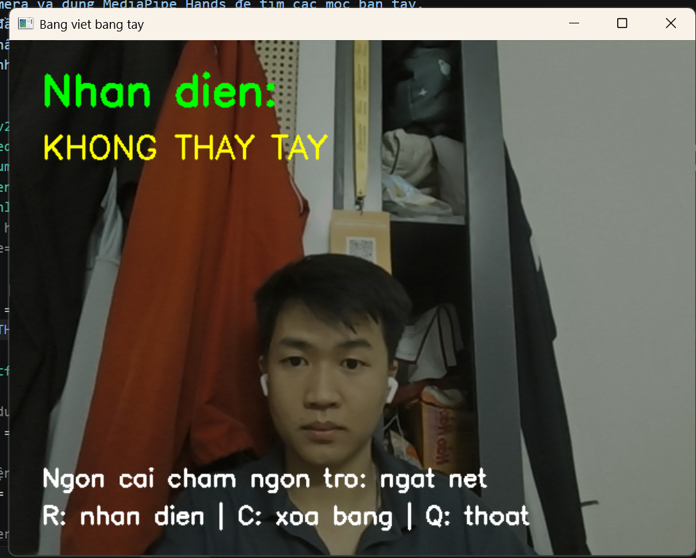

# Air Writing Digit Recognition

Draw a digit in the air with your index finger, then press **r** to classify it as **0–9**. This small Python project combines MediaPipe hand tracking, an OpenCV drawing canvas, and a TensorFlow/Keras convolutional neural network.

## Demo

[Watch the recorded demo (MP4, about 6 seconds)](assets/demo.mp4)



The screenshot shows the interface while no hand is detected. The recording shows an example interaction; it is not an accuracy benchmark. Interface labels are in Vietnamese without diacritics.

## Features

- Track one hand with MediaPipe Hands.
- Draw using the index fingertip; bring the thumb and index finger together to pause the stroke.
- Clear the canvas or recognize one digit using keyboard shortcuts.
- Load the included `digit_model.h5` for inference, or retrain with the supplied MNIST script.

## Setup and run

Use **Python 3.11**, a webcam, and a desktop environment that supports OpenCV windows. The dependency versions match the author's Windows environment. Do not install a second OpenCV package alongside `opencv-contrib-python`.

```bash
git clone https://github.com/DuongDuyet2909/air-writing-digit-demo.git
cd air-writing-digit-demo
python -m venv .venv
```

On Windows PowerShell, activate the environment:

```powershell
.\.venv\Scripts\Activate.ps1
```

On macOS/Linux, use `source .venv/bin/activate` instead. Other platforms have not been verified.

```bash
python -m pip install -r requirements.txt
python air_board_digit.py
```

If PowerShell blocks activation, use `.\.venv\Scripts\python.exe` instead of `python` in the last two commands.

The application uses camera index `0`. Keep the application window focused when using the lowercase keys below.

| Control | Action |
| --- | --- |
| Move index finger with thumb apart | Draw on the canvas |
| Bring thumb and index finger together | Pause drawing / start a separate stroke |
| `r` | Recognize the current drawing |
| `c` | Clear the drawing and prediction |
| `q` | Quit |

## How it works

1. Read and mirror webcam frames.
2. Track the index fingertip (landmark 8) and thumb tip (landmark 4).
3. Connect fingertip positions on a separate canvas when the tips are at least 45 pixels apart.
4. On `r`, threshold the canvas, crop the non-zero region, add square padding, resize to 28 × 28, and normalize pixels to [0, 1].
5. Run the CNN and display the highest-scoring digit class.

The training script defines two convolution/max-pooling blocks, a 128-unit dense layer, and a 10-class softmax output.

## Retraining

From the repository root:

```bash
python train_digit_model.py
```

This downloads MNIST through Keras, trains for 5 epochs, and **overwrites `digit_model.h5` in the current directory**. Back up that file first if you want to keep the bundled weights.

## Limitations and evaluation

- Recognizes one digit at a time, not words, letters, or multiple-digit sequences.
- Hand tracking depends on lighting, occlusion, and camera placement.
- The fixed 45-pixel pinch threshold depends on distance to the camera and frame resolution.
- MNIST handwriting differs from air-drawn strokes, so webcam recognition can fail even when a model performs well on MNIST.
- The current training script uses the MNIST test split as validation during training. No independent air-writing test set or measured webcam accuracy is supplied.
- The classifier selects a digit for any non-empty drawing; it has no unknown-class rejection.

## Project files

```text
air_board_digit.py     Webcam application and drawing preprocessing
train_digit_model.py   CNN training on MNIST
digit_model.h5        Bundled model weights
requirements.txt     Dependency versions
assets/              Screenshot and recorded demo
```

## Future improvements

- Add clear camera/model error messages and guaranteed resource cleanup.
- Normalize the pinch gesture threshold by hand size.
- Evaluate on labeled air-writing examples and report common confusions.
- Separate training validation data from the final test set.

## References

- [MediaPipe](https://github.com/google-ai-edge/mediapipe) supplies pretrained hand tracking.
- [Keras MNIST dataset](https://keras.io/api/datasets/mnist/) supplies the digit training data.
- [OpenCV](https://opencv.org/) provides webcam capture, drawing, and image processing.

This is a learning project built with these libraries; it does not train a hand-tracking model.
