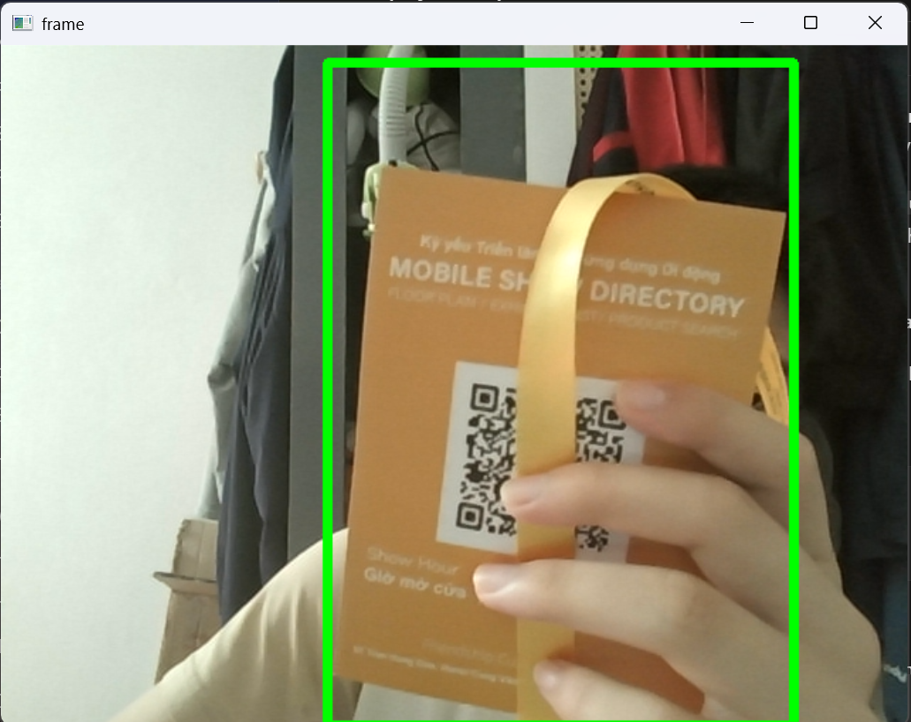
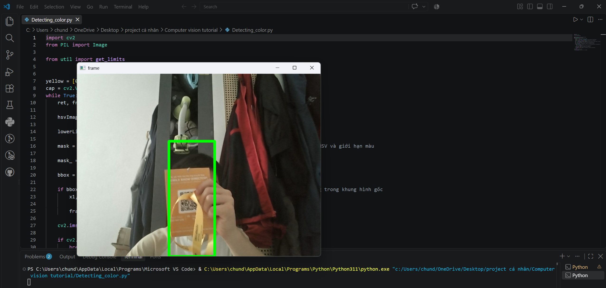

# Webcam Color Detection

A small computer vision project that detects yellow-colored regions
in webcam frames using Python and OpenCV.

## Demo




The green bounding box encloses regions selected by the yellow HSV
threshold. Background regions with similar colors may also be included

## How it works

1. Capture frames from a webcam.
2. Convert each frame from BGR to HSV.
3. Apply color thresholds to create a binary mask.
4. Draw a single bounding box enclosing the non-zero mask pixels.

## Technologies

- Python
- OpenCV
- NumPy
- Pillow

## Installation

```bash
pip install -r requirements.txt
```

## Usage

```bash
python Detecting_color.py
```

A connected webcam is required. The script uses camera index `0`.
Press `q` while the camera window is focused to exit.

## Limitations

- Lighting conditions can affect detection.
- Background regions within the selected color range may be included.
- Multiple separate regions are enclosed in one bounding box.
- The script detects color regions, not object categories.

## Future improvements

- Handle camera initialization and frame-reading failures.
- Filter small noisy regions.
- Detect separate regions using contours.
- Support configurable colors and camera selection.
